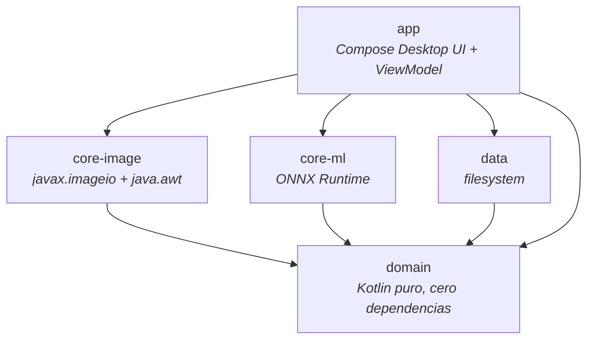

# appremove — Spec técnico
Todas las decisiones de diseño, lectura de codigo y seguiridad son 100% humanas,
Vista de pájaro del proyecto: arquitectura, patrones, lógica de negocio y decisiones clave.
> Objetivo:  volver a este código sin tener que reconstruir el razonamiento desde cero. Si el código y este doc alguna vez se
> contradicen, el código gana — pero si eso pasa, actualizá este archivo en el mismo PR.

## 1. Qué es

App de escritorio para Windows (Kotlin + Compose Multiplatform Desktop) que:
1. **Redimensiona** imágenes a un ancho/alto exacto en píxeles (no es compresión de peso, ver [§5.1](#51-resize)).
2. **Remueve/reemplaza el fondo** de una imagen con un modelo de IA local (ONNX, IS-Net), sin conexión a internet ni servicios en la nube.

Formatos de entrada soportados: `.jpg`, `.jpeg`, `.png` (`AppViewModel.SUPPORTED_EXTENSIONS`). La salida de "remover fondo" siempre es PNG (necesita canal alfa); la salida de "resize" conserva el formato de entrada.

## 2. Arquitectura: Clean Architecture / Hexagonal, en 5 módulos Gradle

**Regla de dependencias (no negociable):** las flechas solo apuntan hacia `domain`. `domain` no depende de ningún otro módulo del proyecto ni de ninguna librería externa (ver `domain/build.gradle.kts`: sin dependencias más que `kotlin("test")` para tests). Esto es lo que permite, por ejemplo, cambiar el motor de resize o el modelo de IA sin tocar una sola línea de `domain`.

| Módulo | Responsabilidad | Depende de |
|---|---|---|
| `domain` | Contratos (`fun interface`, puertos Strategy) + casos de uso + lógica pura de negocio | — |
| `core-image` | Implementación real de resize (`javax.imageio`/`java.awt`, sin libs externas) | `domain` |
| `core-ml` | Implementación real de remoción de fondo (ONNX Runtime + modelo IS-Net embebido) | `domain` |
| `data` | Repositorio de filesystem (dónde escribir la salida) | `domain` |
| `app` | UI (Compose Desktop), ViewModel, wiring manual de todo lo anterior | todos |

## 3. Patrones de diseño usados (y por qué)

- **Strategy, vía `fun interface`** — `ImageResizer` y `BackgroundRemover` (en `domain`) son los puertos; `BufferedImageResizer` (`core-image`) y `OnnxBackgroundRemover` (`core-ml`) son las implementaciones concretas. `domain` no sabe que existe `ImageIO` ni `ONNX Runtime`. Para agregar un algoritmo alternativo (ej. otro modelo de IA), se implementa la interfaz — no se toca `domain` ni la UI.
- **Use Case pattern** (`ResizeImageUseCase`, `RemoveBackgroundUseCase`) — cada uno es una clase con un solo `operator fun invoke(...)`, recibe la Strategy por constructor, valida la entrada (archivo existe, dimensiones positivas) *antes* de invocar la estrategia, y envuelve todo en `Result<T>` para que quien llama no maneje excepciones crudas.
- **Sealed interfaces para modelar variantes cerradas** — `BackgroundChoice` (`Transparent` / `SolidColor` / `Image`) y `OperationStatus` (`Idle` / `Processing` / `Success` / `Error`, en `app`). El compilador obliga a manejar todos los casos en los `when` — si mañana se agrega una variante nueva, todo el código que la ignore no compila.
- **MVVM liviano, sin framework de DI** — `AppViewModel` usa `androidx.compose.runtime.State` (no `androidx.lifecycle.ViewModel`, que no aplica en Compose Desktop puro) y arma sus dependencias a mano en el constructor/propiedades (`ResizeImageUseCase(BufferedImageResizer())`, etc.) — sin Koin/Dagger/Hilt. Es intencional: el grafo de dependencias es chico, no se justifica el framework.
- **Repository** — `OutputPathResolver` (`data`) decide dónde escribir el resultado (mismo directorio que el input, con sufijo, sin pisar un archivo existente).
- **Result wrapping, no excepciones crudas hacia la UI** — ambos casos de uso devuelven `Result<T>`; la UI (`AppViewModel`) hace `.fold(onSuccess, onFailure)` y traduce a `OperationStatus`.

## 4. Lógica de negocio

### 4.1 Resize
- Redimensiona a **exactamente** el ancho/alto pedido — si no respeta la proporción original, la imagen sale deformada *a propósito* (es una decisión de la capa de arriba, no de `core-image`).
- "Mantener proporción" (checkbox en la UI) es lógica pura en `domain.resize.AspectRatio` (regla de tres a partir de ancho/alto originales), independiente de cualquier imagen real — se usa para recalcular el campo contrario cuando el usuario edita ancho o alto.
- JPEG se escribe con calidad fija (`JPEG_QUALITY = 0.82f`, explícita porque el writer default de ImageIO no siempre comprime consistente); PNG preserva transparencia, JPEG rellena fondo blanco (no soporta alfa).
- **"Resize" ≠ "comprimir"**: es una feature de dimensiones en píxeles, no de peso de archivo. No confundir si en el futuro se pide agregar compresión — sería una feature nueva, no una extensión de esta.

### 4.2 Remoción/reemplazo de fondo
- Modelo: **IS-Net "general use"** (de [rembg](https://github.com/danielgatis/rembg), licencia OpenRAIL — ver `README.md`), `core-ml/src/main/resources/models/isnet-general-use.onnx` (~170MB, versionado con Git LFS).
- Preprocesamiento (replica exactamente el de rembg, verificado contra su código fuente): la imagen se reescala a 1024×1024, se normaliza dividiendo cada canal por el valor de píxel más alto **de la propia imagen** (no un `/255` fijo) y centrando en 0.5.
- La sesión de ONNX Runtime (`OrtSession`) se crea una sola vez, perezosamente, en el primer uso — instanciar `OnnxBackgroundRemover` no tiene costo hasta que el usuario aprieta "Remover fondo" (evita parsear 170MB al arrancar la app).
- Salida siempre PNG (necesita canal alfa), sea cual sea el formato de entrada.
- Fondo de reemplazo, vía `BackgroundChoice`: `Transparent` (comportamiento original, solo remover), `SolidColor` (paleta fija de 4 colores en la UI — blanco/negro/verde chroma/celeste, no hay color picker completo), o `Image` (otra imagen, reescalada con estrategia "cover" — cubre el lienzo recortando el sobrante, como `background-size: cover` de CSS).
- Build de CPU, sin CUDA (`core-ml/build.gradle.kts`): es una app de escritorio general, no se puede asumir GPU disponible.

### 4.3 Validaciones y manejo de errores
- Ambos casos de uso rechazan un `input` que no existe/no es archivo **sin invocar la estrategia** (falla rápido, antes de tocar disco o cargar el modelo).
- Formatos no soportados se rechazan en la UI (`AppViewModel.onImageSelected`) — es la última barrera antes de tocar disco, por si el selector nativo de archivos de Windows permite tipear una ruta a mano.
- `OutputPathResolver` nunca pisa un archivo existente: si `foto_resized.jpg` ya existe, prueba `foto_resized_2.jpg`, `_3`, etc.

## 5. UI — sistema de diseño "Bauhaus cromado"

- Ventana **undecorated + transparent**, sin chrome nativo de Windows (`Main.kt`): el único control de sistema es un botón de cerrar propio. El "marco cromado" (`DeviceFrame`) simula un dispositivo físico con degradado metal + sombra exterior.
- Paleta y tipografía centralizadas en `app/theme/` (`AppColors`, `AppTypography`) — grafito + cromo cubren el 95% de la superficie, el dorado se reserva para **un único elemento activo por pantalla** (principio no negociable, ver comentarios en el código).
- Componentes reutilizables ("Kandinsky": Punkt/Fläche/Linie) en `app/components/KandinskyComponents.kt`: `PunktButton` (botón circular de elegir imagen), `FrameSquare` (marco de los inputs de dimensiones), `BackgroundSwatchRow`/swatches, `MetalButton` (CTA secundario), `LuxuryCta` (CTA principal, con glow animado).
- Fuentes (Sora + Fraunces itálica) se cargan a mano desde bytes embebidos en resources (mismo patrón que el modelo ONNX) — no vía `compose.resources`, por una limitación de la API de `Font()` de Compose Desktop para fijar ejes variables en tiempo de ejecución (ver comentario en `AppTypography.kt`).
- El wordmark es **"amover"** (no "appremove") — es la marca visible; "appremove" es el nombre técnico interno (paquete, ejecutable, carpeta de instalación) y así debe quedar, ver [§7](#7-empaquetado--distribución-windows).

## 6. Testing

- `kotlin.test` + JUnit 5 platform (`useJUnitPlatform()` en cada `build.gradle.kts`). Sin framework de mocking (ni Mockito ni MockK) en ningún módulo.
- **Convención: fakes escritos a mano, no mocks.** Gracias a que `ImageResizer`/`BackgroundRemover` son `fun interface`, un test fake es una lambda de una línea (ver `ResizeImageUseCaseTest`: `ImageResizer { _, _, w, h -> ... }`). Esto es posible *porque* domain no conoce las implementaciones reales — mantenerlo así (no romper la pureza de `domain`) es lo que mantiene los tests de casos de uso rápidos y sin I/O real.
- Cobertura actual: casos de uso (`domain`) con fakes, lógica pura (`AspectRatio`), y las implementaciones reales de `core-image`/`core-ml`/`data` con archivos temporales reales (`File.createTempFile`).

## 7. Empaquetado / distribución (Windows)

Ver `app/build.gradle.kts` (`compose.desktop.application.nativeDistributions` + tarea custom `packageMsiBranded`).

- **`./gradlew packageMsi`** — instalador `.msi` estándar de Compose Desktop (jpackage + WiX 3.11, descargado automáticamente). Sin firma de código (SmartScreen advierte "editor no reconocido" — decisión aceptada, proyecto personal). Instalación per-user (sin admin), GUID de upgrade fijo (`appUpgradeUuid`, **nunca regenerar**).
- **`./gradlew packageMsiBranded`** — mismo instalador, pero con wizard visual propio ("amover", Bauhaus cromado) en vez del wizard vacío por defecto de jpackage. Implementado con un `main.wxs` escrito a mano en `app/packaging/wix/` (banner/lateral images propias) + una tarea `Exec` de Gradle que invoca `jpackage` directamente (bypassea el hook inexistente del plugin de Compose para `--resource-dir`). Detalle completo en memoria del proyecto (`project_installer_customization_decision`).
- Para una nueva versión: subir `appPackageVersion` en `app/build.gradle.kts` (usado por ambas tareas), **no tocar** `appUpgradeUuid`.
- El modelo ONNX se versiona con Git LFS (`.gitattributes`); CI no descarga el contenido real de LFS a propósito (no hace falta para compilar/lintear/testear, y ahorra cuota de banda).

## 8. CI/CD

`.github/workflows/ci.yml`, en `ubuntu-latest`, dispara en PR y push a `main`: `ktlintCheck` → `test` → `build`. No compila el instalador Windows en CI (jpackage no puede cross-compilar un `.msi` de Windows desde Linux) — eso se hace a mano, localmente.

## 9. Si querés extender esto en el futuro

- **¿Nuevo formato de imagen?** Agregar a `AppViewModel.SUPPORTED_EXTENSIONS` y al filtro de `pickImageFile()` en `App.kt`. `core-image`/`core-ml` ya delegan el formato en `ImageIO`/el `extension` del archivo, así que no necesitan cambios salvo que el formato no sea soportado por `ImageIO` de base.
- **¿Otro algoritmo/modelo de remoción de fondo?** Implementar `BackgroundRemover` (`domain`) en una clase nueva (puede vivir en `core-ml` o en un módulo nuevo) — no toca `domain` ni `app` salvo el wiring en `AppViewModel`.
- **¿Nueva opción de fondo de reemplazo?** Agregar una variante a `BackgroundChoice` (sealed interface) — el compilador va a marcar todos los `when` que falten actualizar (en `OnnxBackgroundRemover` y en la UI).
- **¿Cambiar cómo se resuelve el nombre/ubicación del archivo de salida?** Es todo `OutputPathResolver` (`data`), aislado del resto.
- **¿Tocar el diseño visual?** Los tokens están en `app/theme/AppColors.kt` / `AppTypography.kt`; los componentes reutilizables en `app/components/KandinskyComponents.kt`. El principio "un solo acento dorado activo por pantalla" es una regla de diseño explícita, no un accidente — respetarla al agregar elementos nuevos.
- **¿Nueva versión del instalador con marca?** Ver [§7](#7-empaquetado--distribución-windows) — no hace falta tocar `packageMsi`, solo `packageMsiBranded` y `app/packaging/wix/main.wxs`.

## 10. Decisiones explícitas que NO son bugs (para no "corregirlas" sin querer)

- `domain` no depende de nada — si un PR le agrega una dependencia (a `java.awt.Color`, a una librería, a otro módulo), es casi seguro un error de diseño, no una necesidad real.
- El resize deforma la imagen si el ancho/alto no respetan la proporción — es intencional, no un bug de `core-image`.
- Sin mocking framework — los fakes a mano son la convención del proyecto, no una carencia.
- Sin DI framework — el wiring manual en `AppViewModel` es deliberado dado el tamaño del grafo de dependencias.
- El wordmark dice "amover" pero el paquete/ejecutable/carpeta siguen llamándose "appremove" — son cosas distintas a propósito (marca visible vs. identidad técnica), ver [§5](#5-ui--sistema-de-diseño-bauhaus-cromado).
